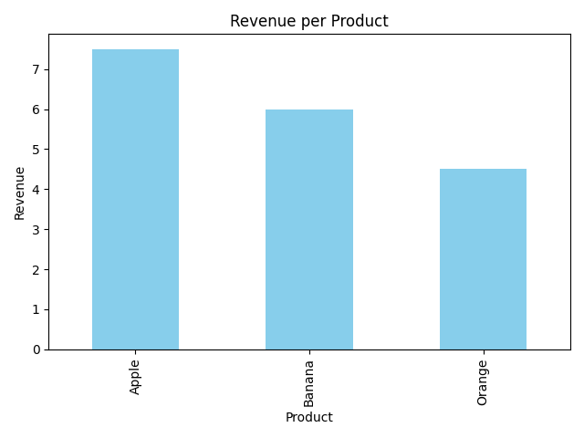

# 📊 Sales Summary Project (Task 7)

[](https://www.python.org/)
[](https://www.sqlite.org/)
[](LICENSE)

---

## 🔹 Overview
This project demonstrates how to use **SQLite** and **Python** to analyze sales data.  
It covers:

- Creating a SQLite database and a `sales` table.
- Inserting sample sales data.
- Running SQL queries to calculate total quantity sold and revenue per product.
- Displaying results using **pandas**.
- Visualizing revenue per product using **matplotlib** bar charts.

This was completed as part of a **Data Analyst Internship Task**.

---

## 📂 Repository Files

| File | Description |
|------|-------------|
| `Task7.ipynb` | Jupyter Notebook with all the code. |
| `sales_data.db` | SQLite database containing the sales table and sample data. |
| `sales_revenue_chart.png` | Bar chart showing total revenue per product. |

---

## ⚙️ Requirements

- Python 3.x
- Libraries: `sqlite3`, `pandas`, `matplotlib`
- Jupyter Notebook (recommended)

Install dependencies (if not already installed):

```bash
pip install pandas matplotlib
🏃 How to Run
Clone or download the repository.

Open Task7.ipynb in Jupyter Notebook.

Run the notebook cells step-by-step:

Database will be created automatically if it doesn’t exist.

Sample data will be inserted.

Sales summary table and revenue chart will be displayed.

The chart (sales_revenue_chart.png) will also be saved automatically in the folder.

💻 SQL Query Used
sql
Copy code
SELECT 
    product, 
    SUM(quantity) AS total_quantity, 
    SUM(quantity * price) AS total_revenue
FROM sales
GROUP BY product;
Calculates total quantity sold and total revenue per product.

📈 Example Output
Sales Summary Table:

Product	Total Quantity	Total Revenue
Apple	15	7.5
Banana	30	6.0
Orange	15	4.5

